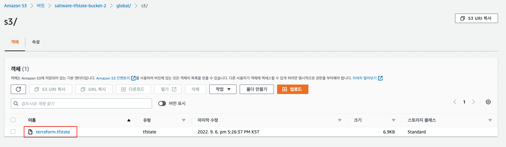
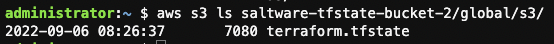
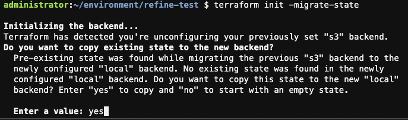
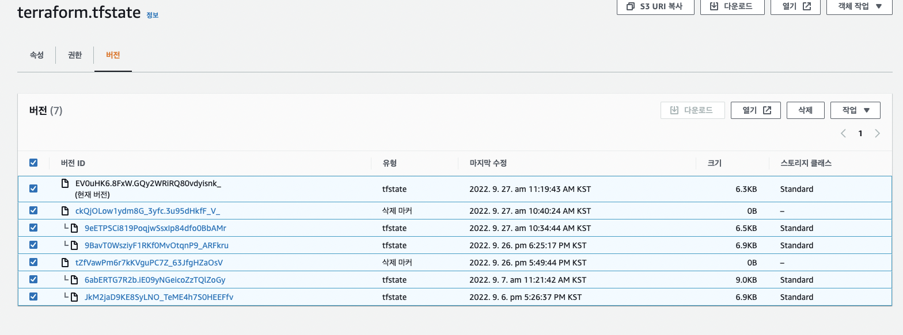

# Terraform state 관리

## 개요

Terraform state 란 Terraform을 실행할때 생성한 인프라에 대한 정보가 기록된 것 입니다. 기본적으로 `terraform apply` 실행시 명령을 실행한 로컬 저장소에 *terraform.tfstate* 파일이 생성 되게 됩니다.

자세한 Terraform state에 관한 내용은 아래 링크의 문서를 참조하시면 됩니다.

<aside>
📖 참조 문서 링크

- Terraform State
[https://www.terraform.io/language/state](https://www.terraform.io/language/state)
- Pusrpose of Terraform State
    
    [https://www.terraform.io/language/state/purpose](https://www.terraform.io/language/state/purpose)
    
</aside>

다수의 유저가 Terraform 템플릿을 통해서 인프라를 관리할 경우 *terraform.tfstate* 파일을 versioning 가능한 원격 저장소에 저장 되는 것이 합리적 입니다. 

Git과 같은 버전 제어 시스템을 이용할 경우 다음 세가지 이슈가 있을 수 있습니다.

- 휴먼 에러
    - Terraform 실행 전 최신 변경 사항을 Pull down 하지 않는 문제
    - Terraform 실행 후 변경 사항을 Push 하지 않는 문제
- 잠금
    - `terraform apply` 동시 실행시 충돌 문제
- 보안
    - 평문으로 저장되는 Terraform State 파일의 보안 문제

위와 같은 문제를 해소하기 위한 방법으로 Terraform Backend를 이용하는 방법을 본 문서에서 기술하도록 하겠습니다.

## Terraform Backend

Terraform Backend의 이용으로 “개요"에서 기술한 세가지 이슈를 해결할 수 있습니다.

- 휴먼 에러 해결
    - 원격 Backend 구성 후 Terraform을 실행할 때마다 해당 Backend에서 Terraform State 파일을 자동으로 로드 합니다.
- 잠금
    - DynamoDB를 이용한 잠금 지원
- 보안
    - 원격 저장소의 암호화를 이용한 보안 강화
    

해당 예제에서는 아래 2개의 파일을 생성하여 사용하도록 하겠습니다.

- *var.tf* : 변수 정의
- *init.tf* *:* backend resource 정의, backend 설정

<aside>
💡 AWS Provider 설정이 완료된 환경에서 진행한 예제 입니다.

</aside>

### 1. Terraform Backend 이용 위한 리소스 템플릿 구성

**1.1 variable 정의**

< > 안에 리소스 이름을 따로 입력해주어야 합니다.

```bash
cat << 'EOF' >> var.tf
variable "BucketName" {
    default = {
        tfstate = "<S3 Bucket Name>"
    }
}

variable "DynamoDB" {
    default = {
        terraformLock = "<DynamoDB Table Name>"
    }
}
EOF
```

**1.2 S3 Bucket 생성**

```bash
cat << 'EOF' >> init.tf
# Create S3 Bucket
resource "aws_s3_bucket" "terraform_state" {
  bucket = "${var.BucketName["tfstate"]}"
  lifecycle {
    prevent_destroy = true
    }
}
EOF
```

**1.3 S3 Bucket versioning 활성화**

```bash
cat << 'EOF' >> init.tf
# S3 versioning enable
resource "aws_s3_bucket_versioning" "enabled" {
    bucket = aws_s3_bucket.terraform_state.id
    versioning_configuration {
        status = "Enabled"
    }
}
EOF
```

**1.3 SSE-S3 활성화**

```bash
cat << 'EOF' >> init.tf
# Enable server-side encryption by default
resource "aws_s3_bucket_server_side_encryption_configuration" "default" {
  bucket = aws_s3_bucket.terraform_state.id
  rule {
    apply_server_side_encryption_by_default {
      sse_algorithm = "AES256"
    }
  }
}
EOF
```

**1.4 S3 Public Access 제한**

```bash
cat << EOF >> init.tf
# Explicitly block all public access to the S3 bucket
resource "aws_s3_bucket_public_access_block" "public_access" {
  bucket                  = aws_s3_bucket.terraform_state.id
  block_public_acls       = true
  block_public_policy     = true
  ignore_public_acls      = true
  restrict_public_buckets = true
}
EOF
```

**1.5 DynamoDB Table 생성**

```bash
cat << 'EOF' >> init.tf
# Create DynamoDB table for terraform lock
resource "aws_dynamodb_table" "terraform_locks" {
  name         = "${var.DynamoDB["terraformLock"]}"
  billing_mode = "PAY_PER_REQUEST"
  hash_key     = "LockID"
  attribute {
    name = "LockID"
    type = "S"
  }
}
EOF
```

**1.6 Terraform 실행**

`terraform plan` 명령어 실행하여 생성되는 리소스 확인 후 `terraform apply` 명령어로 Terraform Backend 구성시 필요한 AWS 리소스들을 생성 합니다.

## 2. Terraform Backend 설정

**2.1 Terraform Backend 설정 추가**

위 “1.1 variable 정의” 에서 설정한 이름을 < > 에 그대로 넣어 줍니다.

backend 설정에 변수를 사용할 수 없기 때문에 S3 버킷 이름과 DynamoDB 테이블 이름을 넣어 주어야 합니다.

```bash
cat << 'EOF' >> init.tf
# backend
terraform {
	 backend "s3" {
	 	bucket = "<S3 Bucket Name>"
	 	key	   = "global/s3/terraform.tfstate"
	 	region = "ap-northeast-2"
	 	dynamodb_table = "<DynamoDB Table Name>"
	 	encrypt = true
	 }
}
EOF
```

**2.2 Terraform init 수행**

설정한 Terraform Backend를 적용 시키기 위해 `terrafom init` 명령어를 수행 합니다.

## 3. Terraform Backend 적용 확인

**3.1 생성된 리소스 확인 코드 추가**

```bash
cat << 'EOF' >> init.tf
output "s3_bucket_arn" {
  value       = aws_s3_bucket.terraform_state.arn
  description = "The ARN of the S3 bucket"
}

output "dynamodb_table_name" {
  value       = aws_dynamodb_table.terraform_locks.name
  description = "The name of the DynamoDB table"
}
EOF
```

**3.2 생성된 리소스 확인**

`terraform apply` 명령어를 실행 합니다.

- 출력 예시

```bash
Apply complete! Resources: 0 added, 0 changed, 0 destroyed.

Outputs:

dynamodb_table_name = "terraformLock"
s3_bucket_arn = "arn:aws:s3:::saltware-tfstate-bucket-2"
```

**3.3 terraform.tfstate 파일 확인**

 **3.3.1 AWS Web console 이용**

- AWS Web console에서 확인한 예시



 **3.3.2 AWS CLI 이용**

아래 명령어를 실행 합니다.

```bash
aws s3 ls <S3 Bucket Name>/global/s3/
```

- AWS CLI 에서 확인한 예시



## 4. Backend 설정 해제

S3 Backend 설정을 해제하여 다시 local에서 state 파일을 관리하게 하는 방법 입니다.

**4.1 Backend 설정, 생성된 리소스 확인 template 삭제 or 주석 처리**

```bash
# terraform {
#   backend "s3" {
#     bucket = "saltware-tfstate-bucket-2"
#     key   = "global/s3/terraform.tfstate"
#     region = "ap-northeast-2"
#     dynamodb_table = "terraformLock"
#     encrypt = true
#   }
# }

# output "s3_bucket_arn" {
#   value       = aws_s3_bucket.terraform_state.arn
#   description = "The ARN of the S3 bucket"
# }

# output "dynamodb_table_name" {
#   value       = aws_dynamodb_table.terraform_locks.name
#   description = "The name of the DynamoDB table"
# }
```

**4.2 State 파일을 Local에서 관리되게 설정**

**`terraform init -migrate-state`** 명령어로 Local에서 terraform.tftstate 파일이 관리되게 설정 합니다.

명령어를 통해 s3에 저장되어 있는 state파일을 Local로 migration 할 수 있습니다.

- 예시



**4.3 Backend 위한 리소스 삭제**

S3버킷을 삭제하기 전에 생성된 terraform.tfstate 파일을 삭제 해야 합니다. versioning을 활성화 했기 때문에 파일의 버전을 전부 삭제 해야 합니다. 



그 후 S3 Bucket, DynamoDB의 resource template를 삭제하거나 주석 처리 합니다.

```bash
# Create S3 Bucket
# resource "aws_s3_bucket" "terraform_state" {
# bucket = "${var.BucketName["tfstate"]}"
# lifecycle {
#     prevent_destroy = true
#     }
# }
# # S3 versioning enable
# resource "aws_s3_bucket_versioning" "enabled" {
#     bucket = aws_s3_bucket.terraform_state.id
#     versioning_configuration {
#         status = "Enabled"
#     }
# }
# # Enable server-side encryption by default
# resource "aws_s3_bucket_server_side_encryption_configuration" "default" {
#   bucket = aws_s3_bucket.terraform_state.id

#   rule {
#     apply_server_side_encryption_by_default {
#       sse_algorithm = "AES256"
#     }
#   }
# }
# # Explicitly block all public access to the S3 bucket
# resource "aws_s3_bucket_public_access_block" "public_access" {
#   bucket                  = aws_s3_bucket.terraform_state.id
#   block_public_acls       = true
#   block_public_policy     = true
#   ignore_public_acls      = true
#   restrict_public_buckets = true
# }
# # Create DynamoDB table for terraform lock
# resource "aws_dynamodb_table" "terraform_locks" {
#   name         = "${var.DynamoDB["terraformLock"]}"
#   billing_mode = "PAY_PER_REQUEST"
#   hash_key     = "LockID"
  

#   attribute {
#     name = "LockID"
#     type = "S"
#   }
# }
```

`terraform apply` 을 실행 하면 리소스가 삭제 됩니다.